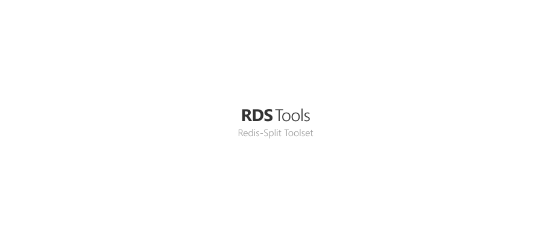

<p align="center"><a href="#readme"></a></p>

<p align="center">
  <a href="https://github.com/essentialkaos/rds-tools/actions"></a>
  <a href="#license"></a>
</p>

<p align="center"><a href="#installation">Installation</a> • <a href="#usage">Usage</a> • <a href="#license">License</a></p>

<br/>

Simple utility for debugging and testing Redis-Split.

### Installation

```bash
bash <(curl -fsSL https://apps.kaos.st/get) knf && sudo mv knf /usr/bin/
curl -fL# -o rds-tools https://kaos.sh/rds-tools/rds-tools && chmod +x rds-tools && sudo mv rds-tools /usr/bin/
```

### Usage


### License

[Apache License, Version 2.0](https://www.apache.org/licenses/LICENSE-2.0)

<p align="center"><a href="https://essentialkaos.com"></a></p>
